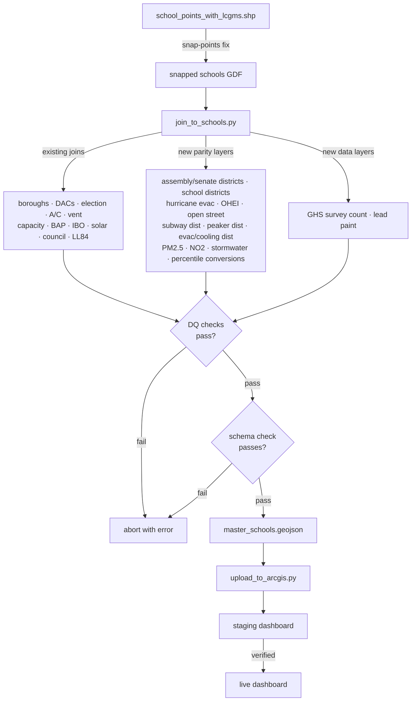
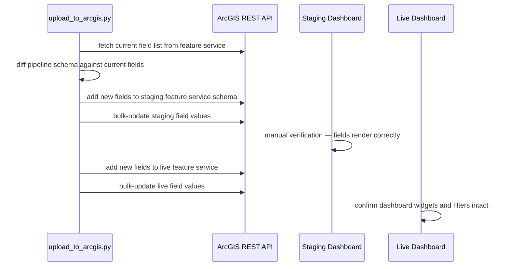

## Summary

Port André's ~12 missing layers into `pipelines/join_to_schools.py`, add a DQ assertion framework after every join step, validate the upload workflow with lead paint and GHS survey data, and wrap the end-to-end pipeline in a `just update` command with scripted ArcGIS column upload. The outcome is a pipeline that can be run reliably monthly and where adding new layers no longer creates drift between the repo and the live dashboard.

---

## Problem Frame

The repo and the live ArcGIS dashboard have drifted: André added ~12 layers directly in ArcGIS that aren't in the pipeline, and field names between the pipeline output and the ArcGIS feature service don't match. This makes local analysis untrustworthy and every proposed update feel risky. The column-by-column ArcGIS upload process also creates a backlog of fully-processed data (lead paint, GHS survey) that hasn't been shipped.

(see origin: docs/brainstorms/2026-06-06-pipeline-parity-and-automation-requirements.md)

---

## Requirements

**Parity (R1–R3)**
- R1: All layers from André's processing notes implemented in `pipelines/join_to_schools.py`: snap points by building code, school districts (verify current), assembly districts, state senate districts, subway walking distance, peaker plant distance, hurricane evac zone, heat exposure index, evac center distance, cooling center distance, air pollution (PM2.5 and NO2), stormwater flood risk, open street flag, and percentile/quartile conversions for LL84 energy and air pollution fields
- R2: Pipeline output column names match the live ArcGIS feature service field names; mismatches surface as errors, not silent renames
- R3: Snap-points-by-building-code geometry fix applied before any spatial joins run

**DQ checks (R4–R6)**
- R4: After each join, assertions verify row count unchanged, null counts on key existing columns haven't increased, no duplicate `LocationCode` values
- R5: Join match rate logged per layer; below-threshold rate halts export with error
- R6: Pre-export assertion compares output field list against a pinned expected schema

**GHS survey (R7–R8)**
- R7: `notebooks/process_ghs_survey_data.ipynb` finalized; only field added to join is count of respondents per school willing to get involved; no raw or identifying survey data
- R8: GHS survey field added to `pipelines/join_to_schools.py`; `process-ghs-survey-data` branch merged and closed

**Upload validation (R9–R10)**
- R9: Lead paint data added to pipeline join and uploaded to ArcGIS (validates upload workflow end-to-end)
- R10: GHS survey data uploaded to ArcGIS (second upload validation exercise)

**Pipeline automation (R11–R12)**
- R11: A single `just update` command runs all processing scripts in sequence and produces updated `master_schools.geojson`
- R12: `just update` includes DQ checks and aborts with a clear error message on any failure

**Upload automation (R13–R14)**
- R13: Scripted column-by-column upload reduces manual ArcGIS update to a single command; no full-service overwrite (would break dashboard widget and filter field mappings)
- R14: New columns tested against a staging dashboard before being applied to the live dashboard

---

## Key Technical Decisions

**KTD1: Snap-points fix runs at pipeline start from immutable source data**
The fix reads `school_points_with_lcgms.shp` and applies building-code centroid alignment as the first transformation in `join_to_schools.py`. The source file is not modified. This keeps source data canonical and the pipeline self-contained — consistent with how all other joins run inline. (Resolves the planning question about save-once vs. re-run.)

**KTD2: André's parity layers ported inline to `join_to_schools.py`**
New parity sections are added to the existing join script, following its current pattern of sequential inline transforms. The full one-file-per-layer refactor is explicitly deferred (see Scope Boundaries). New standalone scripts (`process_ghs_survey_data.py`, `process_lead_paint.py`) are created only for layers that require separate pre-processing before the join.

**KTD3: IBO join unchanged for this plan's scope; `Bldg_Owner` is the non-replaceable field**
The IBO join stays as-is. `building_ownership_description` (`Bldg_Owner` — DOE-owned vs. tax-levy lease) has no independent source. `yearbuilt` (`Bldg_Age`) and other IBO fields are candidates for replacement as independent sources come online — tracked as a separate follow-up, not changed here.

**KTD4: GHS survey output joins via `Loc_Code`; two fields added**
The survey notebook maps `school_clean` names to `Loc_Code` via LCGMS crosswalk and exports a parquet with one row per school: `ghs_willing_count` (respondents where `q10_get_involved == 1`) and `ghs_total_respondents`. The pipeline joins on `Loc_Code`. No raw names or identifying data in the output.

**KTD5: Column reconciliation gated on ArcGIS REST schema fetch**
Before implementing U7, fetch the live 179-field list from the ArcGIS feature service REST endpoint (`?f=json`). The target schema is pinned as a JSON file. Pipeline output columns not in the target schema trigger an assertion error with a field diff, not a silent rename.

**KTD6: Upload automation uses `arcgis` Python package with staging-first policy**
New columns are added to a staging copy of the feature service before the live service. No full-service overwrite. If the `arcgis` package cannot do additive field additions to an existing hosted feature service, fall back to direct ArcGIS REST API calls (`addToDefinition` for schema + `applyEdits` for values).

**KTD7: DQ assertions as a shared helper called after every join**
A `check_join(before, after, join_name, *, null_sentinel_cols, match_col=None, min_match_rate=None)` helper asserts: row count unchanged, null counts on sentinel columns haven't increased, no `LocationCode` duplicates, match rate on `match_col` is above `min_match_rate`. Failure raises with a descriptive message and halts the pipeline. The DQ helper is added early (before parity work) so every new join section gets a check from day one.

---

## High-Level Technical Design

**Pipeline data flow:**



**Upload automation sequence:**



---

## Output Structure

```
pipelines/
├── join_to_schools.py          # expanded with parity layers + DQ helper
├── process_ghs_survey_data.py  # new: standalone survey processing
├── process_lead_paint.py       # new: standalone lead paint processing
└── upload_to_arcgis.py         # new: scripted column-by-column upload

data/
└── processed_data/
    ├── ghs_survey_by_school.parquet     # new: GHS join-ready output
    ├── lead_paint_by_school.parquet     # new: lead paint join-ready output
    └── schema/
        └── arcgis_field_target.json     # new: pinned ArcGIS field list

tests/
└── test_pipeline_dq.py                  # new: DQ helper unit tests
```

---

## Implementation Units

### Phase 1: Foundation

### U1. GHS survey notebook completion and pipeline-ready output

**Goal:** Finalize `process_ghs_survey_data.ipynb` to produce a join-ready parquet keyed on `Loc_Code` with `ghs_willing_count` and `ghs_total_respondents`, then create `pipelines/process_ghs_survey_data.py` replicating that logic for use in `just update`. Closes the `process-ghs-survey-data` branch.

**Requirements:** R7, R8

**Dependencies:** None

**Files:**
- `notebooks/process_ghs_survey_data.ipynb`
- `pipelines/process_ghs_survey_data.py` (new)
- `data/processed_data/ghs_survey_by_school.parquet` (new output)

**Approach:**
- Add a school-name → `Loc_Code` mapping step: normalize both the survey's `school_clean` field and LCGMS school names (lowercase, strip punctuation), then match. Load the LCGMS crosswalk from `data/processed_data/school_points_with_lcgms.shp`.
- Aggregate to school level: `ghs_willing_count = sum(q10_get_involved)`, `ghs_total_respondents = count(responses)`. Use `Loc_Code` as the join key (per-school, not per-building).
- Export parquet with only `Loc_Code`, `ghs_willing_count`, `ghs_total_respondents` — no raw names, grades, or other identifying columns.
- Log match rate of survey school names to LCGMS; flag if below 80%.

**Patterns to follow:** Solar readiness notebook → parquet export pattern in `04_solar_readiness_assessment.ipynb`; column naming style in `join_to_schools.py` rename dict.

**Test scenarios:**
- Output parquet contains zero `Loc_Code` values that don't appear in `school_points_with_lcgms`
- `ghs_willing_count` is non-negative for all rows; `ghs_total_respondents >= ghs_willing_count` for all rows
- No raw respondent names or PII present in the output
- LaGuardia High School maps to the expected `Loc_Code` (known survey respondent school)
- Match rate is logged; running on the 3/18/2026 data achieves at least 80% school name resolution

**Verification:** Output parquet loads cleanly; row count equals distinct schools in survey with at least one response; `ghs_willing_count` correct for a spot-checked school.

---

### U2. Snap-points geometry fix as pipeline first step

**Goal:** Implement the `snap_points_by_BuildingCode` logic as the first transformation in `join_to_schools.py`, aligning school points that share a `Bldg_Code` to a shared centroid before any spatial joins run.

**Requirements:** R3

**Dependencies:** None (runs first in pipeline)

**Files:**
- `pipelines/join_to_schools.py`

**Approach:**
- The file `notebooks/andre_working/snap_points_by_BuildingCode.py` was committed with the wrong content (a TerraCarbon SOC raster script). Implement from André's written description in `docs/Andre Processing Notes.md` item 1: group school points by `Bldg_Code`, compute the centroid of each group's geometries, update the `geometry` (and `Lat`/`Long` fields if present) for all rows in the group to the centroid.
- Insert immediately after loading `school_points_with_lcgms.shp`, before the boroughs join. The source shapefile is not modified.
- When André provides the corrected script, compare and reconcile any differences.

**Patterns to follow:** Existing groupby/geometry operations in geopandas; CRS preservation after geometry reassignment.

**Test scenarios:**
- After the fix, all rows sharing the same `Bldg_Code` have identical geometry
- Row count is unchanged from the source shapefile
- A building code known to have multiple school points (identify one during implementation) converges to a single shared geometry
- CRS of the schools GDF is unchanged after the fix

**Verification:** Assert passes for at least one multi-school building; total row count unchanged.

---

### Phase 2: DQ Framework (added before parity work so every new join benefits)

### U6. DQ assertion helper and per-join check integration

**Goal:** Add a `check_join` helper function to `join_to_schools.py` and call it after every existing and new join step.

**Requirements:** R4, R5, R12

**Dependencies:** U2 (snap-points as first join step; helper is called after each subsequent section)

**Files:**
- `pipelines/join_to_schools.py`
- `tests/test_pipeline_dq.py` (new)

**Approach:**
- Define `check_join(before, after, join_name, *, null_sentinel_cols, match_col=None, min_match_rate=None)` near the top of `join_to_schools.py`:
  - Assert `len(after) == len(before)` — row count unchanged
  - For each col in `null_sentinel_cols`: assert `after[col].isna().sum() <= before[col].isna().sum()`
  - Assert no duplicate `LocationCode`/`Loc_Code` values in `after`
  - If `match_col` provided: compute `rate = after[match_col].notna().mean()`; log it; if below `min_match_rate`, raise with the actual rate in the message
- Retrofit after every existing join section (boroughs, DACs, election, A/C, vent, capacity, BAP, IBO, solar, council, school districts, LL84). Consolidate the existing ad-hoc asserts into this helper.
- Match rate thresholds per join type: 0.99 for key-based tabular joins (A/C, BAP, solar); 0.80 for spatial joins with known geographic gaps; 0.50 for limited-coverage datasets (IBO). Document the threshold choice in a comment above each call.

**Test scenarios (in `tests/test_pipeline_dq.py`):**
- `check_join` raises `AssertionError` when `after` has more rows than `before` (many-to-one join without dedup)
- `check_join` raises when a sentinel column gains nulls in `after`
- `check_join` raises when `after` contains duplicate `Loc_Code` values
- `check_join` raises when match rate is below `min_match_rate`; error message includes the actual rate
- `check_join` passes silently when all conditions are met
- `check_join` logs match rate to stdout even when above threshold

**Verification:** Running the pipeline end-to-end with the helper retrofitted to all existing joins completes without assertion failures on current data.

---

### Phase 3: Parity Layers

### U3. Polygon zone joins — assembly districts, senate districts, school districts, hurricane evac, OHEI, open street flag

**Goal:** Add six polygon-join sections to `join_to_schools.py` producing `AssemDist`, `StSenDist`, `SchoolDist` (verify/update), `hurricane_evacZone`, `OHEI`, and `on_open_street` fields.

**Requirements:** R1

**Dependencies:** U2, U6

**Files:**
- `pipelines/join_to_schools.py`
- `data/raw_data/NYC Planning/` (assembly: `nyad_25d`, senate: `nyss_25d` — download steps included)

**Approach:**
- **Assembly and senate districts**: Download `nyad_25d` and `nyss_25d` from NYC OpenData (URLs in André's notes); reproject to schools CRS; `sjoin(..., predicate="within")`; produce `AssemDist` and `StSenDist` fields. Codify download URL as a comment.
- **School districts**: The pipeline already has a school districts join (`nysd_26a`). Verify the dataset version against what André used (André's notes mention he re-did this with a more updated version). If stale, update to current version from NYC OpenData. This is a verify step, not a guaranteed change.
- **Hurricane evac zone and OHEI**: Adapt `notebooks/andre_working/hurricaneEvac_HeatIndex_distEvacCenters_distCoolingCenters.py` — the spatial join sections (Sections 4 and 5) for `hurricane_evacZone` and `OHEI`. Replace Windows paths with repo-relative paths; use left join; call `check_join` after each.
- **Open street flag**: Stub section with a TODO comment pending Abhi's data source and 300ft buffer methodology. Do not block parity work on it — leave `on_open_street` null in the output until resolved.
- Call `check_join` after each section with appropriate sentinel columns.

**Patterns to follow:** Existing `sjoin` sections in `join_to_schools.py` — CRS alignment before join, `drop(columns=["index_right"])` after join, left join semantics.

**Test scenarios:**
- Row count unchanged after each polygon join
- No school has a null `AssemDist` or `StSenDist` (every NYC school falls within a district)
- A school known to be in a hurricane evacuation zone has the expected `hurricane_evacZone` value
- Null counts on pre-existing columns (e.g., `ZohrPrimR1`, `in_dac`) unchanged after each join
- Covers R1 / AE for assembly districts: `AssemDist` present and non-null for all schools after join

**Verification:** Five new fields present (`on_open_street` may be null pending Abhi); no null district values; `check_join` passes for each section.

---

### U4. Distance fields — subway, peaker plant, evac centers, cooling centers

**Goal:** Add four distance calculation sections to `join_to_schools.py` producing `subway_dist`, `peaker_mi`, `evacCenters_distance_mi`, and `cooling_centers_distance_mi`.

**Requirements:** R1

**Dependencies:** U2, U6

**Files:**
- `pipelines/join_to_schools.py`
- `notebooks/andre_working/dist_to_subway_processing.py` (reference)
- `notebooks/andre_working/hurricaneEvac_HeatIndex_distEvacCenters_distCoolingCenters.py` (reference — Sections 6 and 7)
- `notebooks/andre_working/download_geojson_from_arc_server.py` (utility for subway layer)
- `data/raw_data/peaker_plants_all.geojson` (already present)

**Approach:**
- **Subway distance**: Download walking-distance polygons from the ArcGIS feature server URL in André's notes using the `download_geojson_from_arc_server.py` pattern; `sjoin` points within polygons to get `WalkingB_1`; create `subway_dist` as a standardized text field ("0-5 min", "5-10 min", ">10 min") following `dist_to_subway_processing.py`.
- **Peaker plant distance**: Use existing `data/raw_data/peaker_plants_all.geojson`; buffer schools by 5 miles; clip plants to buffer; `sjoin_nearest` in EPSG:2263 (NYC feet); convert to miles → `peaker_mi`.
- **Evac and cooling center distances**: Adapt Sections 6 and 7 of `hurricaneEvac_HeatIndex_distEvacCenters_distCoolingCenters.py`; download cooling centers from ArcGIS feature server URL; `sjoin_nearest` in EPSG:2263 for both; convert to miles.
- All distance calculations: project to EPSG:2263 for computation, convert to miles, reproject back to original CRS.

**Patterns to follow:** `sjoin_nearest` already used in `join_to_schools.py` (election results fallback) — follow the same CRS round-trip pattern.

**Test scenarios:**
- Row count unchanged after each distance calculation
- `subway_dist` contains only expected text values; no raw numeric or null values (nulls replaced with ">10 min")
- All schools have a non-null `peaker_mi` value
- `evacCenters_distance_mi` and `cooling_centers_distance_mi` are non-negative for all schools
- Null counts on pre-existing columns unchanged after each section

**Verification:** Four distance fields present; all non-null; no negative values; known Manhattan school has `subway_dist` of "0-5 min" or "5-10 min".

---

### U5. Environmental rasters, stormwater ranked join, and percentile/quartile conversions

**Goal:** Add PM2.5 and NO2 raster sampling, stormwater flood risk ranked join, and percentile/quartile field conversions for 13 continuous fields.

**Requirements:** R1

**Dependencies:** U2, U3, U6

**Files:**
- `pipelines/join_to_schools.py`
- `notebooks/andre_working/process_air_pollution_and_join.py` (reference)
- `notebooks/andre_working/storm_water_ranked_join.py` (reference)
- `notebooks/andre_working/convert_continous_to_percentile_class.py` (reference)
- `pyproject.toml` (add `rasterio` dependency)

**Approach:**
- **Air pollution**: Sample NYCCAS rasters (`aa14_pm300m` for PM2.5, `aa14_no2300m` for NO2) at school point locations using `rasterio`; add `pm25_2022` and `no2_2022` continuous fields. Include a comment with the NYC OpenData download URL for the raster archive.
- **Stormwater**: The raw stormwater download has filename-length unzip issues (noted by André). Use the pre-processed layer from André's Google Drive link; add it to `data/raw_data/` with provenance documented in a comment. Buffer school points by 300 feet; ranked join assigns the highest flood risk polygon (rank 1 = most severe) to each school via the pattern in `storm_water_ranked_join.py`; produces `Flood_Scenario` and `Stormwater_Flood_Risk`.
- **Percentile/quartile conversion**: After all joins, convert 13 continuous fields (air pollution: `pm25_2022`, `no2_2022`; LL84: energy star score, GHG intensity, site EUI, percent electricity, 8 fuel fields) to quartile categories using `pd.qcut(q=4)`. Null values → "No data" string. Quartile column names follow the `_pct` suffix convention from André's script.
- Apply conversion as the last step before the rename dict and export block.

**Patterns to follow:** Rasterio point sampling from `process_air_pollution_and_join.py`; stormwater buffer + ranked join from `storm_water_ranked_join.py`; quartile logic from `convert_continous_to_percentile_class.py`.

**Test scenarios:**
- `pm25_2022` and `no2_2022` non-null for all schools (NYCCAS rasters cover all of NYC)
- `Stormwater_Flood_Risk` values are in {1, 2, 3, 4, null}; null only for schools outside all flood polygons
- `Flood_Scenario` values match André's four scenario strings exactly
- All 13 `_pct` quartile columns present; values in {0, 1, 2, 3, "No data"}
- Quartile distribution is approximately 25% per non-null bucket for a continuous field
- Null counts on pre-existing columns unchanged

**Verification:** All new fields present; raster sampling returns plausible values for known high-pollution neighborhoods (e.g., South Bronx); quartile buckets roughly balanced.

---

### Phase 4: Schema Alignment and New Data Layers

### U7. Column name reconciliation and pinned schema validation

**Goal:** Compare pipeline output schema against the live ArcGIS 179-field schema, reconcile all mismatches into the `shortened_cols` rename dict, and add a pre-export assertion that output columns exactly match a pinned target.

**Requirements:** R2, R6

**Dependencies:** U3, U4, U5 (all parity fields must be in the output first)

**Files:**
- `pipelines/join_to_schools.py`
- `data/processed_data/schema/arcgis_field_target.json` (new — pinned field list)

**Approach:**
- **Prerequisite step before implementation**: Fetch the ArcGIS feature service field list from the REST endpoint (`?f=json`; URL in `docs/plan.md`). Extract all `fields[].name` values. Save to `data/processed_data/schema/arcgis_field_target.json`. This is the target schema.
- **Comparison**: Run the pipeline to produce a candidate output; compare column names against the target. Three buckets: (a) pipeline → ArcGIS name mapping → add to `shortened_cols`; (b) pipeline columns absent from ArcGIS → decide: upload backlog (new) or drop (stale); (c) ArcGIS columns absent from pipeline → remaining parity gaps.
- **IBO fields**: If `building_ownership_description` and `yearbuilt` are absent from ArcGIS, add them to an upload backlog note — do not drop. If present with different names, add renames.
- **Schema assertion**: After rename, add pre-export check: assert pipeline output columns equal the pinned target set. Column added unexpectedly → assertion error with the extra column named. Column dropped → assertion error with the missing column named.
- `shortened_cols` in `join_to_schools.py` remains the single source of truth for all renames.

**Test scenarios:**
- Pipeline output after rename contains `ZohrPrimR1` (not `ZohranFirstRoundFrac`) — the confirmed mismatch is resolved
- Schema assertion passes on a clean run
- Adding a spurious column to the output triggers the assertion error naming the unexpected column
- Removing a column from the rename dict triggers the assertion error naming the missing column

**Verification:** All output columns match the pinned ArcGIS field names; `shortened_cols` reviewed against fetched schema; no unintended columns in output; pinned JSON committed to the repo.

---

### U8. Lead paint notebook completion and GHS survey + lead paint join integration

**Goal:** Complete `notebooks/schools_lead_paint.ipynb` to produce a join-ready parquet; create `pipelines/process_lead_paint.py`; add both GHS survey and lead paint sections to `join_to_schools.py`.

**Requirements:** R8, R9 (pipeline integration portion)

**Dependencies:** U1 (GHS survey parquet), U6 (DQ helper), U7 (schema validation in place)

**Files:**
- `notebooks/schools_lead_paint.ipynb`
- `pipelines/process_lead_paint.py` (new)
- `data/processed_data/lead_paint_by_school.parquet` (new output)
- `pipelines/join_to_schools.py`

**Approach:**
- **Lead paint notebook**: Fetch 2021–2024 lead paint hazard data from DOE/DOH sources (identify the appropriate NYC OpenData endpoint); aggregate to building code (e.g., violation count, most recent inspection date, hazard present flag); export as parquet keyed on `Bldg_Code`. Create `pipelines/process_lead_paint.py` replicating the notebook logic.
- **GHS survey join**: Read `ghs_survey_by_school.parquet`; merge on `Loc_Code` with `how="left"`; call `check_join`.
- **Lead paint join**: Read `lead_paint_by_school.parquet`; merge on `Bldg_Code` with `how="left"`; call `check_join`.
- Add both sections after all existing joins, before the rename dict and export block.

**Patterns to follow:** Existing pandas merge pattern for tabular data (A/C, ventilation); `check_join` call pattern from U6; parquet export pattern from U1.

**Test scenarios:**
- Row count unchanged after GHS survey join; after lead paint join
- Null counts on pre-existing columns unchanged after each join
- `ghs_willing_count` is non-null for schools known to appear in the survey; null for schools with no responses
- Lead paint fields are non-null for at least some buildings (validates data presence)
- `ghs_total_respondents >= ghs_willing_count` holds for all non-null rows after join

**Verification:** Both fields present in output GeoJSON; row count unchanged end-to-end; `check_join` passes for both new joins.

---

### Phase 5: Automation

### U9. `just update` pipeline command

**Goal:** Add a `just update` recipe that runs all processing scripts in sequence, produces updated `master_schools.geojson`, and propagates DQ failures as non-zero exit codes.

**Requirements:** R11, R12

**Dependencies:** U6 (DQ helper halts pipeline on failure), U8 (all data layers in pipeline)

**Files:**
- `justfile`

**Approach:**
- The `just update` recipe runs in order: `pipelines/process_ghs_survey_data.py`, `pipelines/process_lead_paint.py`, `pipelines/join_to_schools.py`. Future standalone processing scripts follow the same pattern.
- DQ failures in `join_to_schools.py` already raise `AssertionError` which exits non-zero — `just` propagates this automatically.
- Each step prints a clear progress header (e.g., "--- Running GHS survey processing ---") so operators know where a failure occurred.
- Add `_ensure-venv` prerequisite consistent with existing just recipes.

**Test scenarios:**
- `just update` runs end-to-end and produces a valid, parseable `master_schools.geojson`
- Running `just update` twice produces identical output (idempotent given unchanged inputs)
- Injecting a null into a sentinel field in the test data causes `just update` to exit non-zero with a readable error

**Verification:** `just update` completes without errors on current data; output GeoJSON file timestamp is updated; output file is valid GeoJSON.

---

### U10. Scripted column-by-column ArcGIS upload

**Goal:** Create `pipelines/upload_to_arcgis.py` that adds new columns to an existing ArcGIS hosted feature service without full overwrite, with a staging-first workflow.

**Requirements:** R9 (upload portion), R10, R13, R14

**Dependencies:** U7 (schema aligned), U8 (new columns in pipeline output), U9 (clean output from `just update`)

**Files:**
- `pipelines/upload_to_arcgis.py` (new)
- `pyproject.toml` (add `arcgis` dependency)
- `.env.example` (add ArcGIS credentials and item IDs)

**Approach:**
- Script accepts: path to `master_schools.geojson`, and a `--target staging|live` flag. Target feature service item IDs and credentials come from environment variables.
- Logic: (1) fetch current field list from the target feature service; (2) diff against `master_schools.geojson` columns; (3) for each new column, add field to the service schema; (4) bulk-update values using the `arcgis` package. Only additive — does not modify or overwrite existing fields.
- If `arcgis` package cannot do additive field additions without a full overwrite: fall back to ArcGIS REST API directly (`addToDefinition` for schema additions, `applyEdits` for value updates).
- Include a `--dry-run` flag that prints the columns to be added without making API calls.
- Staging workflow: run `--target staging` first (satisfies R14), verify in the dashboard, then `--target live`.
- Add `ARCGIS_USERNAME`, `ARCGIS_PASSWORD` (or `ARCGIS_TOKEN`), `ARCGIS_ITEM_ID_STAGING`, `ARCGIS_ITEM_ID_LIVE` to `.env.example`.

**Patterns to follow:** Existing `.env` usage in the repo (Google Maps key); no existing ArcGIS API code — reference `arcgis` Python package documentation.

**Test scenarios:**
- Script correctly identifies columns in `master_schools.geojson` absent from the current ArcGIS schema
- Script does not attempt to modify or overwrite existing columns
- `--dry-run` outputs the list of columns to add without making API calls
- `--target staging` does not affect the live feature service item
- Script exits with a clear error if any required env var is missing
- Running the script a second time with no new columns produces a no-op (nothing to add)

**Verification:** After `--target staging` run, the staging dashboard shows new columns populated for spot-checked schools; live dashboard unchanged; after `--target live` run, live dashboard shows new columns.

---

## Scope Boundaries

### In scope
- All 14 requirements from the origin document (R1–R14)
- Lead paint notebook completion (prerequisite for R9)
- School districts dataset version check/update (part of R1)
- Open street flag stub (R1) — full implementation pending Abhi's data/methodology

### Deferred to follow-up work
- Full one-file-per-layer pipeline refactor (north star from `docs/plan.md`) — deferred until parity and automation are complete and the pattern is established
- IBO field migration to independent data sources — ongoing separate workstream; `Bldg_Owner` retained; other IBO fields reviewed as replacements come online
- Ventilation/A/C web scraping — requires getting existing scraping code into the repo first (separate workstream)
- School locations simplification (LCGMS-only + Google Maps) — deferred until before next LCGMS data drop in 2026
- Net-new data layers (green schoolyard, lead pipes, asbestos, etc.) — start after upload workflow is validated
- Open street flag full implementation — requires Abhi's data source and 300ft buffer approach

### Outside this product's identity
- ArcGIS dashboard replacement — remains a long-term aspiration; no comparable open-source alternative available within current constraints

---

## Risks & Dependencies

**`snap_points_by_BuildingCode.py` is the wrong file**
The file at `notebooks/andre_working/snap_points_by_BuildingCode.py` contains a TerraCarbon SOC raster script, not the school snap-points code. U2 implements the logic from André's written description in `docs/Andre Processing Notes.md`. André has been asked to send the corrected file; reconcile U2's implementation against it when received.

**`arcgis` package column-addition capability is unverified**
The upload approach (R13) assumes the `arcgis` Python package can add fields to an existing hosted feature service without a full overwrite. Verify this before starting U10. If it cannot, the fallback is direct REST API calls — this changes U10's implementation significantly but not its interface or the staging-first policy.

**Open street flag depends on Abhi**
The `on_open_street` field (R1) requires Abhi's data source and 300ft buffer methodology. U3 includes a stub; the field remains null in the output until Abhi provides the source.

**Column name reconciliation requires the ArcGIS field list**
U7 cannot be fully scoped until the live field list is fetched. The fetch is the first step of U7. The diff may reveal additional parity gaps beyond the known `ZohranFirstRoundFrac` → `ZohrPrimR1` mismatch.

**Lead paint notebook is incomplete**
`notebooks/schools_lead_paint.ipynb` is an untracked file with no corresponding output in `data/processed_data/`. Lead paint notebook completion is included in U8's scope, not a pre-condition for this plan.

**Stormwater raw data has filename-length unzip issues**
André's notes mention the raw stormwater download zip fails to unzip due to overly long filenames. The pre-processed layer from André's Google Drive is the practical path. Commit it to `data/raw_data/` with provenance documented.

---

## Open Questions

**Deferred to implementation:**
- Match rate thresholds per layer — establish after first pipeline run reveals actual rates. Starting defaults: 0.99 for exact key joins (A/C, BAP, solar), 0.80 for spatial joins with geographic gaps (stormwater, subway), 0.50 for limited-coverage datasets (IBO). Adjust and document the rationale per join.
- Lead paint join key — `Bldg_Code` is most likely, but verify against the lead paint source data structure during U8.
- ArcGIS item IDs for staging and live feature services — configure in `.env` at the start of U10.
- IBO field ArcGIS status — the full field diff in U7 will determine whether `Bldg_Owner`, `Bldg_Age`, and `yearbuilt` appear in the live ArcGIS schema. If absent, add to the upload backlog note in U10.
- School districts dataset version — verify during U3 whether the existing `nysd_26a` join is current or needs updating to André's newer version.

---

## Sources & Research

- André's processing notes: `docs/Andre Processing Notes.md`
- André's reference scripts (all with Windows hardcoded paths, adapt for repo): `notebooks/andre_working/`
- Current pipeline: `pipelines/join_to_schools.py`
- Live ArcGIS feature service (179 fields, REST queryable): URL documented in `docs/plan.md`
- ArcGIS dashboard item: URL documented in `docs/plan.md`
- Project plan and north star: `docs/plan.md`
- Origin requirements document: `docs/brainstorms/2026-06-06-pipeline-parity-and-automation-requirements.md`
